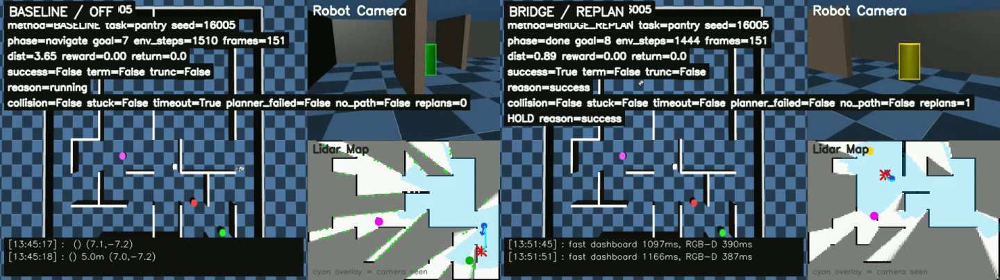

# Bridge Advisor for LLM-Guided MuJoCo Navigation

中文 | [English](#english)

## Demo Video / 演示视频

[](https://cdn.jsdelivr.net/gh/BigWhiteCPN/bridge_llm_and_sac@main/assets/demo-slow.mp4)

[观看 demo 视频 / Watch the demo video](https://cdn.jsdelivr.net/gh/BigWhiteCPN/bridge_llm_and_sac@main/assets/demo-slow.mp4)
（[WebM 备用链接 / WebM fallback](https://cdn.jsdelivr.net/gh/BigWhiteCPN/bridge_llm_and_sac@main/assets/demo-slow.webm)）。

这个基础演示视频是约 0.67x 速度的慢放版本，展示同一个 pantry 任务、同一个 seed 下的成对 A/B 评估。左侧是
`BASELINE / OFF`，右侧是 `BRIDGE / REPLAN`。视频 overlay 显示了 method、task、
seed、phase、env steps、distance、success 和 done reason，结束后会短暂 hold 住
最终状态，方便检查是否成功到达目标。

- Baseline: `success=false`, `done_reason=timeout/episode_horizon_env_steps`,
  `env_steps=2615`, `path_length=34.55m`, `collision=false`
- Bridge/Replan: `success=true`, `done_reason=success`, `env_steps=1444`,
  `path_length=19.17m`, `num_replans=1`, `collision=false`
- Result files: [summary.json](data/showcase_pantry_seed16005_safe_demo/summary.json),
  [results.json](data/showcase_pantry_seed16005_safe_demo/results.json)

This is a single showcase run. Aggregate claims such as average step reduction
should be reported from multi-seed batch experiments.

## 中文

### 简介

这个仓库是
[mujoco-humanoid-hierarchical-rl-llm-spatial-navigation](https://github.com/BigWhiteCPN/mujoco-humanoid-hierarchical-rl-llm-spatial-navigation)
项目的 bridge/advisor 训练模块，用来评估 LLM 高层规划与 SAC 导航之间的桥接策略。

父项目仍然负责机器人运行时、MuJoCo 环境、SAC `go_to` 导航、空间记忆、拓扑地图和视觉扫描。
这个模块只处理桥接层：

- 从运行中的 `NavigationSkill.go_to()` callback 记录地图、机器人状态、记忆和候选目标
- 把记录保存成 `.npz` episode，供离线训练和评估使用
- 训练 `BridgeNet` 判断当前导航段的事件、失败风险和是否需要重规划
- 在线运行时用 advisor 给出是否提前结束当前 `go_to` 的建议
- 跑离线 replay、阈值扫描和成对 A/B 实验

BridgeNet 不输出关节动作、速度指令，也不替代 SAC。SAC 继续执行局部导航；
LLM 继续负责高层任务拆解。BridgeNet 读取导航过程中的状态，给出事件判断、
风险分数和当前 `go_to` 是否值得继续的建议。

### 运行时接入方式

在线采集和 advisor 控制通过 hook 当前 `NavigationSkill` 实例实现，不改
父项目的运行代码。

hook 的位置是 `NavigationSkill.go_to(..., step_callback=..., callback_freq=...)`。
每隔 `callback_freq` 个 env step，原本的 frontier 更新 callback 会被调用一次；
bridge 在同一个 callback 里记录 snapshot，并在加载 checkpoint 时运行一次 advisor
推理。如果 advisor 或 progress guard 判断应该停止，callback 返回 `True`，当前
`go_to` 提前结束，外层 frontier/LLM 逻辑继续选择下一步。

常用频率：

- `collect_runtime` 默认 `callback_freq=40`
- `collect_runtime_batch` 和 `run_ab_experiment` 默认 `callback_freq=20`
- 当前环境中一个 env step 约为 `0.04s` 模拟时间，因此 `callback_freq=20` 约每
  `0.8s` 推理一次
- `sequence_len=16` 表示模型最多使用最近 16 帧 bridge 观测；不足 16 帧时用第一帧
  padding，推理从第一帧就开始

### 模型输入和输出

`BridgeNet-v1` 使用地图、机器人状态、任务、空间记忆和候选目标作为输入。

```text
map layers       -> CNN map tokens
robot state      -> MLP state token
TaskSpec ids     -> task token
memory/topology  -> MLP memory token
candidate goals  -> MLP candidate tokens

query tokens:   [CLS, task, state, skill]
context tokens: [map tokens, memory token, candidate tokens]

cross-attention + transformer fusion
        -> GRU temporal head
        -> event / replan / outcome / candidate-score heads
```

主要输出：

- `event`: continue、navigation_stuck、path_invalidated、low_information_gain 等
- `replan`: continue_current、switch_subgoal、interrupt_and_scan 等
- `failure_risk`: 未来几个 callback 内进入失败/重规划状态的概率
- `success/stuck/target_found/cost/info_gain`
- `candidate_scores`: 候选目标排序分数

当前运行时状态向量是 22 维：

- 前 16 维：机器人位置、朝向、目标相对位置、距离、局部进展、地图覆盖和记忆统计
- 后 6 维：当前 `go_to` 段的进度记忆，包括 callback 数、起始距离、历史最佳距离、
  总进展、相对最佳点的退化和最近窗口进展

这 6 个 segment 特征让 advisor 能看到“这段导航是否真的在变好”，而不是只看当前一帧。

### 目录结构

```text
.
├── bridge/              # 模型、数据集、recorder、advisor、hook 和 arbitration
├── scripts/             # 数据采集、训练、评估、A/B 和 smoke 命令入口
├── tests/               # 基础 smoke tests
├── README.md
├── requirements.txt
└── .gitignore
```

`data/`、`runs/`、checkpoint、日志和 `.npz` episode 通常是本地实验产物，不纳入版本控制。
本仓库只保留少量 `data/showcase_*` 和 `data/ab_video_showcase` 文件作为首页 demo。

### 安装

```bash
pip install -r requirements.txt
```

这个模块通常和已有 MuJoCo/训练环境一起使用：

```bash
export MUJOCO_PYTHON=/path/to/mujoco_env/bin/python
```

### 快速自检

生成合成数据：

```bash
python -m scripts.make_synthetic_dataset \
  --output-dir data/synthetic \
  --episodes 32 \
  --steps 96
```

训练一个短 run：

```bash
python -m scripts.train \
  --data-dir data/synthetic \
  --epochs 3 \
  --batch-size 8
```

验证 episode 和模型前向：

```bash
python -m scripts.validate_episode data/synthetic
python -m scripts.smoke_forward
```

使用 MuJoCo 环境：

```bash
$MUJOCO_PYTHON -m scripts.smoke_forward
```

### 运行时数据采集

单次采集：

```bash
$MUJOCO_PYTHON -m scripts.collect_runtime \
  --agent-root /path/to/mujoco-humanoid-hierarchical-rl-llm-spatial-navigation \
  --output-dir data/runtime \
  --max-rounds 2 \
  --nav-steps-per-round 800 \
  --target-place 会议室
```

批量采集：

```bash
$MUJOCO_PYTHON -m scripts.collect_runtime_batch \
  --output-dir data/runtime_v1 \
  --episodes 10 \
  --max-rounds 1 \
  --nav-steps-per-round 400
```

合并数据集：

```bash
$MUJOCO_PYTHON -m scripts.merge_episodes \
  --output-dir data/runtime_merged \
  --overwrite \
  data/runtime_v1 data/runtime_v2
```

### 训练和评估

从 runtime 数据训练：

```bash
$MUJOCO_PYTHON -m scripts.train \
  --data-dir data/runtime_merged \
  --output-dir runs/runtime_bridge_v1 \
  --epochs 80 \
  --batch-size 8 \
  --sequence-len 16 \
  --hidden-dim 128 \
  --fusion-layers 2 \
  --num-heads 4 \
  --device cuda \
  --split-by episode \
  --val-fraction 0.2 \
  --balanced-class-loss \
  --patience 12 \
  --lr 0.0001
```

从 checkpoint 继续训练：

```bash
$MUJOCO_PYTHON -m scripts.train \
  --data-dir data/runtime_merged \
  --output-dir runs/runtime_bridge_finetune \
  --init-checkpoint runs/pretrain/best.pt \
  --epochs 80 \
  --device cuda
```

评估：

```bash
$MUJOCO_PYTHON -m scripts.evaluate \
  --checkpoint runs/runtime_bridge_v1/best.pt \
  --data-dir data/runtime_merged \
  --split val
```

### Advisor 和 A/B

离线回放：

```bash
$MUJOCO_PYTHON -m scripts.smoke_advisor \
  --checkpoint runs/runtime_bridge_v1/best.pt \
  --data-dir data/runtime_merged \
  --device cpu
```

在线采集时启用 advisor：

```bash
$MUJOCO_PYTHON -m scripts.collect_runtime \
  --output-dir data/runtime_advisor \
  --episode-id advisor_001 \
  --max-rounds 1 \
  --nav-steps-per-round 250 \
  --target-place 会议室 \
  --advisor-checkpoint runs/runtime_bridge_v1/best.pt \
  --advisor-device cpu \
  --advisor-control replan \
  --advisor-stop-confidence 0.92 \
  --advisor-stop-consecutive 2 \
  --advisor-warmup-steps 6
```

控制模式：

- `off`: 只记录和打印 advisor 结果，不介入导航
- `safe`: 只允许目标/子目标完成类提前停止
- `risk`: 只使用失败风险触发提前停止
- `replan`: 允许 stuck、低信息增益、路径失效和失败风险触发提前停止

成对 A/B 实验：

```bash
$MUJOCO_PYTHON -m scripts.run_ab_experiment \
  --output-dir data/ab_runtime_v1 \
  --episodes 5 \
  --seed-base 12000 \
  --max-rounds 1 \
  --nav-steps-per-round 300 \
  --advisor-checkpoint runs/runtime_bridge_v1/best.pt \
  --advisor-device cpu
```

100 次成对任务统计：

```bash
$MUJOCO_PYTHON -m scripts.run_ab_experiment \
  --output-dir data/ab_runtime_100_seed20000 \
  --episodes 100 \
  --seed-base 20000 \
  --max-rounds 6 \
  --nav-steps-per-round 800 \
  --advisor-checkpoint runs/runtime_hindsight_segment_v1_riskhead_seed1/best.pt \
  --advisor-device cpu
```

生成统计表和首页/论文可用的 SVG 图：

```bash
python -m scripts.plot_ab_statistics \
  data/ab_runtime_100_seed20000 \
  --output-dir reports/ab_runtime_100_seed20000 \
  --title "Bridge Advisor A/B Evaluation (N=100)"
```

输出包括：

- `reports/ab_runtime_100_seed20000/ab_statistics.svg`
- `reports/ab_runtime_100_seed20000/ab_statistics.md`
- `reports/ab_runtime_100_seed20000/metrics_summary.csv`
- `reports/ab_runtime_100_seed20000/pair_results.csv`

统计脚本只读取真实 `results.json`，不会根据单个 showcase 视频外推平均提升。

### Episode 格式

episode 保存为压缩 `.npz`：

```text
data/<dataset_name>/episodes/episode_000001.npz
```

主要数组：

```text
maps: [T, C, H, W] float32
state: [T, state_dim] float32
memory: [T, memory_dim] float32
task: [T, 3] int64
skill: [T] int64
candidates: [T, K, candidate_dim] float32
candidate_mask: [T, K] bool
event: [T] int64
replan: [T] int64
success/stuck/target_found/cost/info_gain: [T] float32
candidate_score_target: [T, K] float32
```

### 当前实验状态

单个 showcase 只能说明评估流程和可视化效果。要证明 bridge 中间层是否稳定提升效率，
需要使用上面的多 seed 成对 A/B 统计，报告 success rate、episode steps、path length
和 final distance 的均值与配对差值。当前比较稳的线上方案是：

- 保留 hybrid control 作为 fallback
- 继续把 risk-head advisor 作为学习型 bridge 的主线
- 增加 guard-triggered 和 non-triggered segment 数据
- 先校准 failure-risk 阈值，再逐步减少手写 progress reflex 的权重

### 开发命令

```bash
python -m py_compile bridge/*.py scripts/*.py tests/*.py
pytest
```

常用数据检查：

```bash
python -m scripts.summarize_episodes data/runtime_merged
python -m scripts.audit_splits --data-dir data/runtime_merged --seed-start 1 --seed-end 30
python -m scripts.sweep_risk_thresholds --checkpoint runs/runtime_bridge_v1/best.pt --data-dir data/runtime_merged
```

---

## English

### Overview

This repository contains the bridge/advisor training module for
[mujoco-humanoid-hierarchical-rl-llm-spatial-navigation](https://github.com/BigWhiteCPN/mujoco-humanoid-hierarchical-rl-llm-spatial-navigation).
It evaluates bridge policies between high-level LLM planning and SAC navigation.

The parent project remains responsible for the MuJoCo runtime, SAC `go_to`
navigation, spatial memory, topological maps and visual scanning. This module
handles only the bridge layer:

- recording maps, robot state, memory and candidate goals from the running
  `NavigationSkill.go_to()` callback
- saving runtime traces as `.npz` episodes for offline training and evaluation
- training `BridgeNet` to classify navigation events, estimate failure risk and
  suggest replanning
- using an online advisor to decide whether the current `go_to` segment should
  end early
- running offline replay, threshold sweeps and paired A/B experiments

BridgeNet does not output joint actions or velocity commands, and it does not
replace SAC. SAC still handles local navigation, and the LLM still handles
high-level task decomposition. BridgeNet reads the navigation state and returns
event predictions, risk scores and a recommendation about whether the current
`go_to` segment should continue.

### Runtime Integration

Online collection and advisor control are installed by wrapping the current
`NavigationSkill` instance. The robot runtime source code is not modified.

The integration point is `NavigationSkill.go_to(..., step_callback=...,
callback_freq=...)`. Every `callback_freq` environment steps, the existing
frontier-update callback is called. The bridge records a snapshot at the same
point and, when a checkpoint is loaded, runs one advisor inference. If the
advisor or progress guard decides to stop, the callback returns `True`; the
current `go_to` exits early and the outer frontier/LLM logic chooses the next
action.

Common timing:

- `collect_runtime` defaults to `callback_freq=40`
- `collect_runtime_batch` and `run_ab_experiment` default to `callback_freq=20`
- one environment step is about `0.04s` of simulated time in the current setup,
  so `callback_freq=20` gives one advisor inference about every `0.8s`
- `sequence_len=16` means the model uses up to the latest 16 bridge frames; if
  fewer frames are available, the first frame is padded, so inference starts on
  the first observed frame

### Model Inputs and Outputs

`BridgeNet-v1` consumes map layers, robot state, task ids, spatial memory and
candidate goals.

```text
map layers       -> CNN map tokens
robot state      -> MLP state token
TaskSpec ids     -> task token
memory/topology  -> MLP memory token
candidate goals  -> MLP candidate tokens

query tokens:   [CLS, task, state, skill]
context tokens: [map tokens, memory token, candidate tokens]

cross-attention + transformer fusion
        -> GRU temporal head
        -> event / replan / outcome / candidate-score heads
```

Main outputs:

- `event`: continue, navigation_stuck, path_invalidated, low_information_gain, ...
- `replan`: continue_current, switch_subgoal, interrupt_and_scan, ...
- `failure_risk`: probability of entering a failure/replan state within the next
  few callbacks
- `success/stuck/target_found/cost/info_gain`
- `candidate_scores`: ranking scores for candidate goals

The current runtime state vector is 22-D:

- first 16 dimensions: robot pose, relative target, distance, local progress,
  map coverage and memory statistics
- last 6 dimensions: active `go_to` segment memory, including callback count,
  start distance, best distance, total progress, regret from best distance and
  recent-window progress

The segment features let the advisor see whether the current navigation segment
is improving over time instead of judging only from a single frame.

### Layout

```text
.
├── bridge/              # Model, dataset, recorder, advisor, hooks, arbitration
├── scripts/             # Collection, training, evaluation, A/B and smoke CLIs
├── tests/               # Basic smoke tests
├── README.md
├── requirements.txt
└── .gitignore
```

`data/`, `runs/`, checkpoints, logs and `.npz` episodes are usually local
experiment outputs and are not tracked by Git. This repository keeps only a
small `data/showcase_*` and `data/ab_video_showcase` subset for the homepage
demo.

### Installation

```bash
pip install -r requirements.txt
```

The module is usually run with the existing MuJoCo/training Python:

```bash
export MUJOCO_PYTHON=/path/to/mujoco_env/bin/python
```

### Quick Check

```bash
python -m scripts.make_synthetic_dataset \
  --output-dir data/synthetic \
  --episodes 32 \
  --steps 96

python -m scripts.train \
  --data-dir data/synthetic \
  --epochs 3 \
  --batch-size 8

python -m scripts.validate_episode data/synthetic
python -m scripts.smoke_forward
```

With MuJoCo Python:

```bash
$MUJOCO_PYTHON -m scripts.smoke_forward
```

### Runtime Collection

Single run:

```bash
$MUJOCO_PYTHON -m scripts.collect_runtime \
  --agent-root /path/to/mujoco-humanoid-hierarchical-rl-llm-spatial-navigation \
  --output-dir data/runtime \
  --max-rounds 2 \
  --nav-steps-per-round 800 \
  --target-place 会议室
```

Batch collection:

```bash
$MUJOCO_PYTHON -m scripts.collect_runtime_batch \
  --output-dir data/runtime_v1 \
  --episodes 10 \
  --max-rounds 1 \
  --nav-steps-per-round 400
```

Merge datasets:

```bash
$MUJOCO_PYTHON -m scripts.merge_episodes \
  --output-dir data/runtime_merged \
  --overwrite \
  data/runtime_v1 data/runtime_v2
```

### Training and Evaluation

```bash
$MUJOCO_PYTHON -m scripts.train \
  --data-dir data/runtime_merged \
  --output-dir runs/runtime_bridge_v1 \
  --epochs 80 \
  --batch-size 8 \
  --sequence-len 16 \
  --hidden-dim 128 \
  --fusion-layers 2 \
  --num-heads 4 \
  --device cuda \
  --split-by episode \
  --val-fraction 0.2 \
  --balanced-class-loss \
  --patience 12 \
  --lr 0.0001
```

Continue from a checkpoint:

```bash
$MUJOCO_PYTHON -m scripts.train \
  --data-dir data/runtime_merged \
  --output-dir runs/runtime_bridge_finetune \
  --init-checkpoint runs/pretrain/best.pt \
  --epochs 80 \
  --device cuda
```

Evaluate:

```bash
$MUJOCO_PYTHON -m scripts.evaluate \
  --checkpoint runs/runtime_bridge_v1/best.pt \
  --data-dir data/runtime_merged \
  --split val
```

### Advisor and A/B

Offline replay:

```bash
$MUJOCO_PYTHON -m scripts.smoke_advisor \
  --checkpoint runs/runtime_bridge_v1/best.pt \
  --data-dir data/runtime_merged \
  --device cpu
```

Online advisor control:

```bash
$MUJOCO_PYTHON -m scripts.collect_runtime \
  --output-dir data/runtime_advisor \
  --episode-id advisor_001 \
  --max-rounds 1 \
  --nav-steps-per-round 250 \
  --target-place 会议室 \
  --advisor-checkpoint runs/runtime_bridge_v1/best.pt \
  --advisor-device cpu \
  --advisor-control replan \
  --advisor-stop-confidence 0.92 \
  --advisor-stop-consecutive 2 \
  --advisor-warmup-steps 6
```

Control modes:

- `off`: record and print advisor outputs without changing navigation
- `safe`: only stop for target/subgoal completion
- `risk`: stop only on failure-risk triggers
- `replan`: stop on stuck, low information gain, invalid path or high failure risk

Paired A/B experiment:

```bash
$MUJOCO_PYTHON -m scripts.run_ab_experiment \
  --output-dir data/ab_runtime_v1 \
  --episodes 5 \
  --seed-base 12000 \
  --max-rounds 1 \
  --nav-steps-per-round 300 \
  --advisor-checkpoint runs/runtime_bridge_v1/best.pt \
  --advisor-device cpu
```

100 paired episodes:

```bash
$MUJOCO_PYTHON -m scripts.run_ab_experiment \
  --output-dir data/ab_runtime_100_seed20000 \
  --episodes 100 \
  --seed-base 20000 \
  --max-rounds 6 \
  --nav-steps-per-round 800 \
  --advisor-checkpoint runs/runtime_hindsight_segment_v1_riskhead_seed1/best.pt \
  --advisor-device cpu
```

Generate CSV, Markdown and a GitHub-readable SVG figure from the real result
files:

```bash
python -m scripts.plot_ab_statistics \
  data/ab_runtime_100_seed20000 \
  --output-dir reports/ab_runtime_100_seed20000 \
  --title "Bridge Advisor A/B Evaluation (N=100)"
```

Outputs:

- `reports/ab_runtime_100_seed20000/ab_statistics.svg`
- `reports/ab_runtime_100_seed20000/ab_statistics.md`
- `reports/ab_runtime_100_seed20000/metrics_summary.csv`
- `reports/ab_runtime_100_seed20000/pair_results.csv`

The statistics script reads only actual `results.json` files. Do not infer
average gains from a single showcase video.

### Episode Format

Episodes are compressed `.npz` files:

```text
data/<dataset_name>/episodes/episode_000001.npz
```

Main arrays:

```text
maps: [T, C, H, W] float32
state: [T, state_dim] float32
memory: [T, memory_dim] float32
task: [T, 3] int64
skill: [T] int64
candidates: [T, K, candidate_dim] float32
candidate_mask: [T, K] bool
event: [T] int64
replan: [T] int64
success/stuck/target_found/cost/info_gain: [T] float32
candidate_score_target: [T, K] float32
```

### Current Status

The single showcase demonstrates the evaluation and visualization flow. To
claim a stable bridge-layer efficiency gain, run the multi-seed paired A/B
evaluation above and report success rate, episode steps, path length, final
distance and paired deltas. The current robust online direction is:

- keep hybrid control as the robust online setting
- continue using the risk-head advisor as the main learned bridge
- collect more guard-triggered and non-triggered segment data
- calibrate failure-risk thresholds before reducing the hand-written progress
  reflex

### Development

```bash
python -m py_compile bridge/*.py scripts/*.py tests/*.py
pytest
```

Useful dataset checks:

```bash
python -m scripts.summarize_episodes data/runtime_merged
python -m scripts.audit_splits --data-dir data/runtime_merged --seed-start 1 --seed-end 30
python -m scripts.sweep_risk_thresholds --checkpoint runs/runtime_bridge_v1/best.pt --data-dir data/runtime_merged
```
